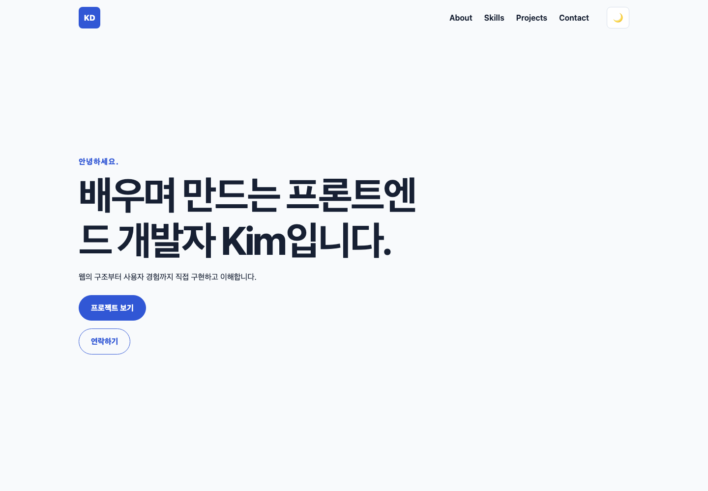
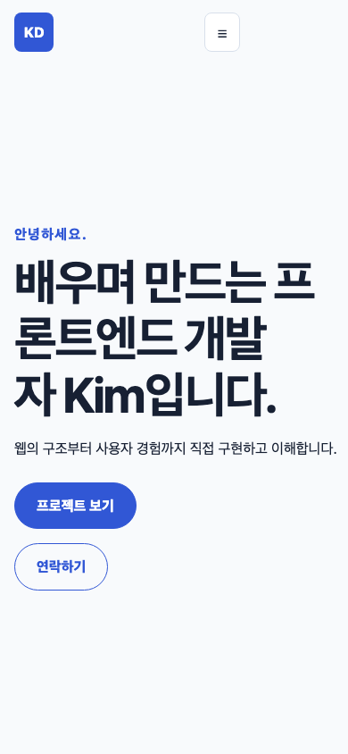
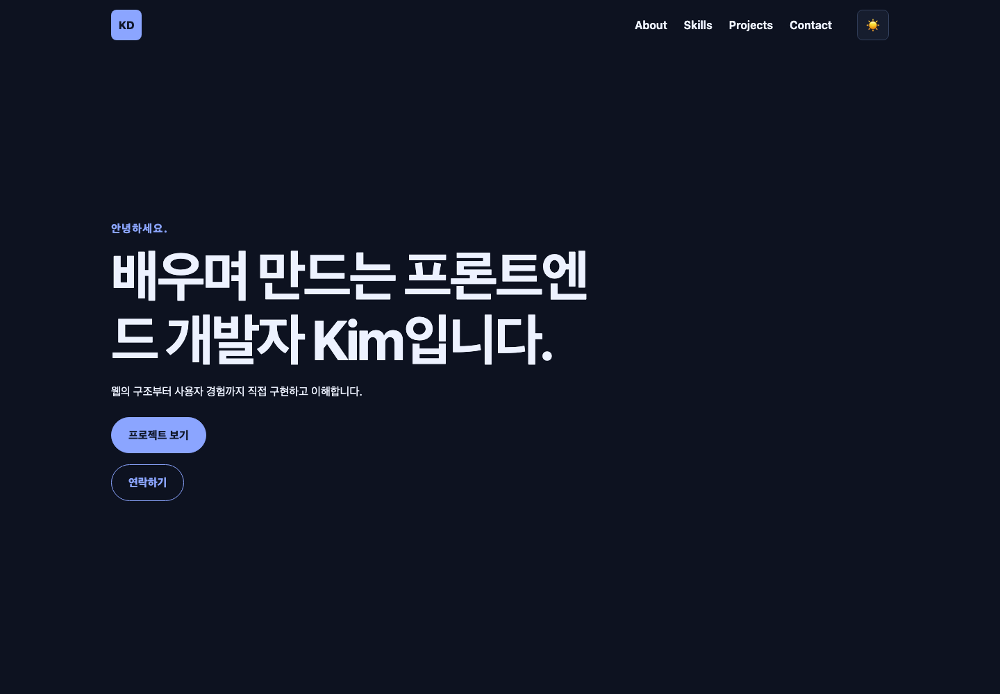

# Vanilla Frontend Portfolio

외부 프레임워크 없이 HTML, CSS, JavaScript만으로 만든 반응형 학습용 포트폴리오입니다. 브라우저의 이벤트가 상태를 바꾸고, 그 상태가 DOM과 화면에 반영되는 흐름을 직접 구현하는 것이 핵심입니다.

## 주요 기능

* Header, Hero, About, Skills, Projects, Contact, Footer의 시맨틱 구조
* 320px 모바일부터 데스크톱까지 대응하는 모바일 퍼스트 레이아웃
* 햄버거 메뉴, 내부 링크 스크롤, 스크롤 반응형 Header와 맨 위 버튼
* `localStorage`에 선택을 유지하는 라이트/다크 테마
* 입력 중 및 제출 시 동작하는 문의 폼 검증
* GitHub REST API 기반 프로젝트 로딩·성공·빈 결과·오류·재시도 UI
* 키보드 포커스 표시, ARIA 상태, 모션 감소 설정 대응

## 기술과 구조

```text
.
├── index.html                    # 문서 구조와 접근성 관계
├── css/style.css                 # 디자인 토큰, 반응형 레이아웃, 테마
├── js/
│   ├── navigation.js             # 모바일 메뉴와 내부 탐색
│   ├── theme.js                  # 테마 상태와 저장
│   ├── scroll.js                 # 스크롤 파생 UI와 관찰자
│   ├── contact.js                # 폼 값·오류 상태와 검증
│   └── projects.js               # GitHub API 요청 상태와 카드 렌더링
├── images/profile-placeholder.svg
└── docs/learning/                # 설계 결정, 체크포인트, 학습 현황
```

애플리케이션 라이브러리, CSS 프레임워크, 번들러 없이 최신 브라우저가 원본 파일을 직접 실행합니다. 각 스크립트는 `defer`와 IIFE를 사용해 HTML 파싱 이후 독립적으로 초기화됩니다.

## 로컬 실행

VS Code에서는 프로젝트 루트를 열고 Live Server의 **Open with Live Server**를 실행합니다. 별도 확장 없이 확인하려면 다음과 같이 정적 서버를 사용할 수 있습니다.

```bash
python3 -m http.server 4173
```

브라우저에서 `http://localhost:4173`을 엽니다. HTML 파일을 `file://`로 직접 여는 것보다 HTTP 서버를 사용하는 편이 실제 배포와 같은 URL·요청·응답·origin 환경을 제공합니다.

## 교체할 포트폴리오 정보

* `index.html`의 이름, 소개, Footer, 소셜 링크를 본인 정보로 바꿉니다.
* `images/profile-placeholder.svg`를 본인 이미지로 교체하고 `alt`, `width`, `height`를 함께 조정합니다.
* `js/projects.js`의 `GITHUB_USERNAME`을 본인 GitHub 사용자명으로 변경합니다.

현재 `GITHUB_USERNAME`은 교체가 쉬운 공개 예시 계정 `octocat`입니다. 인증 없는 GitHub API는 IP 기준 시간당 60회 제한이 있으므로 반복 새로고침 시 `403` 안내가 나타날 수 있습니다. 토큰이나 비밀 키는 브라우저 코드에 넣지 않습니다.

## 동작 기준값

| 동작 | 기준 |
| --- | ---: |
| Header 스크롤 스타일 | `60px` 초과 |
| 맨 위 버튼 표시 | `300px` 초과 |
| Intersection Observer | `0.2` |
| 태블릿 breakpoint | `768px` |
| 데스크톱 breakpoint | `1024px` |
| GitHub 저장소 표시 수 | `6` |

## 검증

```bash
for file in js/*.js; do node --check "$file"; done
git diff --check
rg -n "onclick=|oninput=|onsubmit=|style=" index.html js css
rg -n "\\bvar\\b" index.html js
```

브라우저에서는 다음을 확인합니다.

1. 320px, 768px, 1024px 이상에서 가로 넘침과 읽기 어려운 레이아웃이 없는지 확인합니다.
2. 키보드만으로 링크, 메뉴, 테마, 폼, 재시도, 맨 위 버튼을 사용할 수 있는지 확인합니다.
3. 테마 선택이 새로고침 후 유지되는지 확인합니다.
4. 폼의 빈 값, 잘못된 이메일, 정상 제출 결과를 확인합니다.
5. Network에서 로컬 자원과 GitHub API의 상태 및 응답을 확인합니다.

로컬 Lighthouse 기준 점수는 Performance 99, Accessibility 100, SEO 100입니다. 로컬 Python 정적 서버의 캐시 정책과 응답 지연은 실제 GitHub Pages 배포 후 다시 측정합니다.

## 배포

GitHub Pages: [https://k-sungwon.github.io/web-resume-vanilla/](https://k-sungwon.github.io/web-resume-vanilla/)

`main` 브랜치의 저장소 루트를 GitHub Pages가 정적 파일로 배포합니다. HTTPS 운영 주소에서 상대 CSS/JavaScript/SVG 경로, GitHub API 카드 6개, 테마 복원, 폼 검증을 다시 확인했습니다.

### 데스크톱



### 모바일



### 다크 모드


