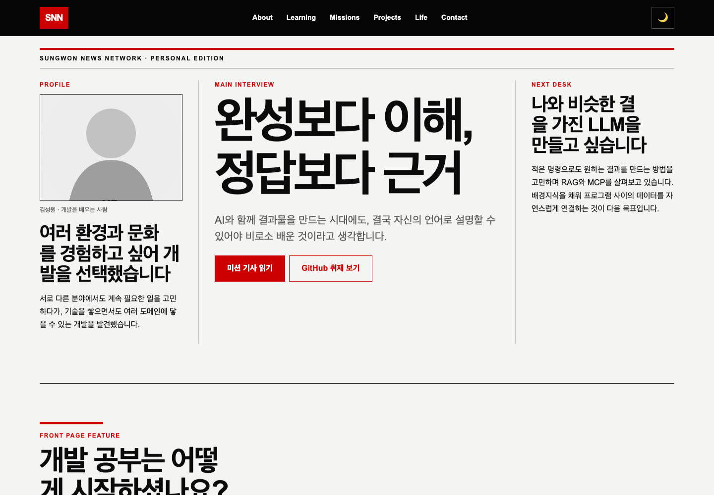
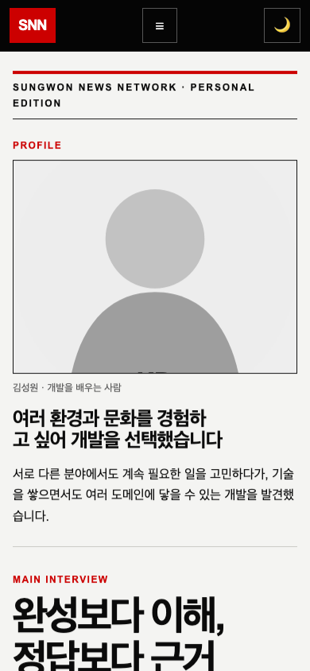
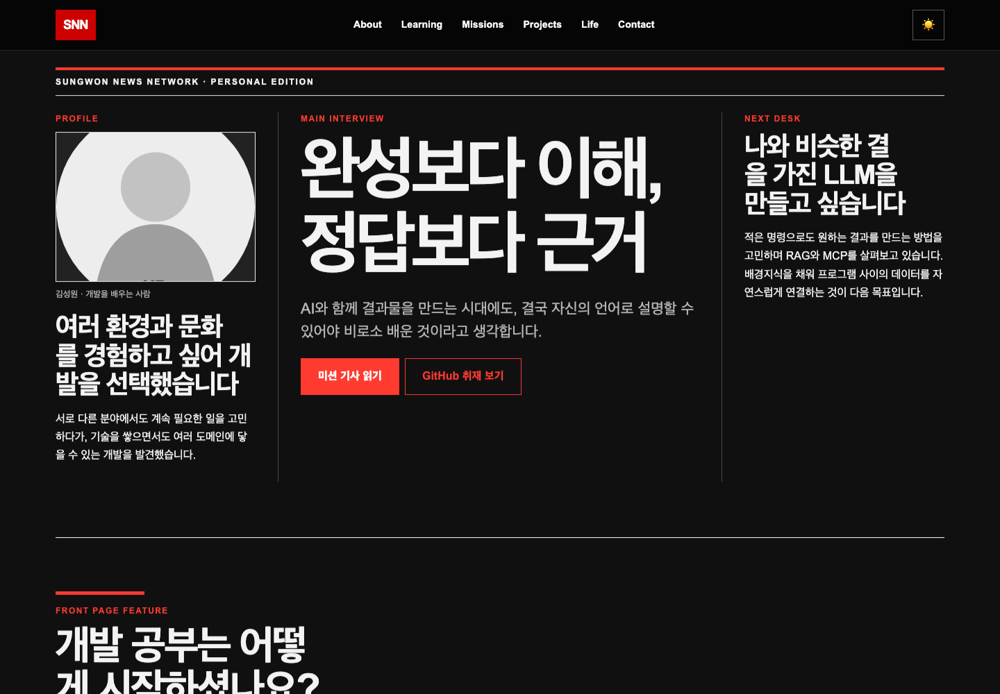

# SNN — Sungwon News Network

김성원의 개발 학습, Codyssey 미션, GitHub 프로젝트, 관심사를 뉴스 기사처럼 읽을 수 있게 만든 개인 자기소개 사이트입니다. 외부 프레임워크 없이 HTML, CSS, JavaScript로 문서 구조, 반응형 배치, 이벤트와 상태, 네트워크 상태를 직접 구현한 학습 프로젝트입니다.

## 지면 구성

* Front Page: 개발을 시작한 이유와 학습 기준
* Learning: Codyssey를 선택한 이유와 자신의 언어로 설명하는 학습법
* Codyssey Report: Shell/Docker, Python Quiz, Tiny NPU 미션 회고
* Skills Desk: HTML, CSS, JavaScript, Git, Python, Docker의 사용 맥락
* GitHub Projects: 네 개 저장소의 README 미리보기와 인터뷰 기사
* Life & Culture: 러닝, 《광마회귀》, 헤드폰과 음악 감상
* Send a Tip: 입력값을 전송하지 않는 클라이언트 폼 검증 데모

## 구조와 기술 선택

```text
.
├── index.html                    # 시맨틱 문서와 접근성 관계
├── css/style.css                 # SNN 토큰, Day/Night, 반응형 레이아웃
├── js/
│   ├── navigation.js             # 모바일 메뉴와 내부 탐색
│   ├── theme.js                  # Day/Night 상태와 localStorage
│   ├── scroll.js                 # Header, 맨 위 버튼, reveal 상태
│   ├── contact.js                # 폼 값·오류·성공 상태
│   └── projects.js               # 로컬 편집 데이터 + GitHub API 병합
├── images/projects/              # 1200 × 675 README 미리보기
├── images/screenshots/           # 검증된 Day, mobile, Night 화면
└── docs/learning/                # 설계 결정, 체크포인트, 학습 현황
```

각 스크립트는 `defer` 된 IIFE로 독립적으로 초기화됩니다. 빌드 도구가 없어 브라우저가 원본 HTML, CSS, JavaScript를 그대로 요청하고 실행합니다.

### 프로젝트 데이터 흐름

`projects.js`는 로컬의 안정적인 기사 순서·감상·이미지와 GitHub API의 변할 수 있는 설명·언어·별·업데이트 시각을 저장소 이름으로 합칩니다.

```text
초기 로드/재시도 → loading → GitHub 응답 → 편집 순서 merge → success | empty | error → DOM
```

화면은 `loading`, `success`, `empty`, `error` 네 요청 상태를 표현합니다. `403` 오류는 GitHub API 요청 한도 안내를 따로 보여주고, 오류 상태의 재시도 버튼은 같은 로드 함수를 다시 실행합니다. 원격 문자열은 HTML escape 후 렌더링하고, HTTPS `github.com` 이외의 URL은 안전한 프로필 링크로 바꿍니다.

### Day/Night와 Send a Tip

Day/Night Edition은 `<html>`의 `data-theme`이 표현의 단일 기준입니다. 선택은 `localStorage`에 저장되지만, 저장소가 막혀도 현재 페이지의 테마 전환은 계속 동작합니다.

Send a Tip은 `preventDefault()` 후 브라우저에서만 필수값과 이메일 형식을 확인합니다. 서버나 이메일 서비스로 입력값을 전송하지 않으며, 성공 문구도 이 사실을 명시합니다.

## 로컬 실행

```bash
python3 -m http.server 4173
```

`http://localhost:4173`을 엽니다. `file://` 대신 HTTP 서버를 쓰면 배포와 비슷한 URL·요청·응답·origin 환경에서 GitHub API까지 확인할 수 있습니다.

## 동작 기준값

| 동작 | 기준 |
| --- | ---: |
| Header 스크롤 스타일 | `60px` 이상 |
| 맨 위 버튼 표시 | `300px` 이상 |
| Intersection Observer | `0.2` |
| 태블릿 breakpoint | `768px` |
| 데스크톱 breakpoint | `1024px` |
| GitHub API 요청 상한 | `100` repositories |

## 검증

```bash
for file in js/*.js; do node --check "$file"; done
git diff --check
rg -n "onclick=|oninput=|onsubmit=|style=" index.html js css
rg -n "\\bvar\\b" index.html js
rg -n "Developing Story|octocat|Kim Developer|>KD<" index.html js css
```

2026-09-29 로컬 릴리스 후보에서 확인한 결과입니다.

* 320px: 단일 열, 햄버거 메뉴, 프로젝트 1열, 가로 overflow `0`
* 768px: 주요 기사 2열, 프로젝트 2열, 데스크톱 탐색, 가로 overflow `0`
* 1024px: `0.8fr / 1.6fr / 0.8fr` 리드 3열, 미션·프로젝트 3열, 가로 overflow `0`
* 키보드: 모바일 메뉴, 내부 링크, 테마, 폼, 맨 위 버튼 동작
* 프로젝트: 실제 4개, 누락, 빈 응답, 404, 403, 네트워크 거부, 재시도, 악성 문자열, 깨진 이미지
* 접근성: `h1` 1개, 건너뛴 단계 없음, 구획 label, 이미지 alt/크기, 폼 label/description, live region
* Night Edition 버튼 대비: 기본 `5.75:1`, hover `7.31:1`; Day Edition도 WCAG AA 통과
* 모션 감소: media query 일치, 전환 `0.01ms`, reveal 불투명도 `1`, 위치 이동 없음
* Lighthouse: Performance `100`, Accessibility `100`, Best Practices `100`, SEO `100`; 콘솔 오류·깨진 요청 `0`, 이미지 크기 audit 통과, CLS `0.000008`

## 배포

현재 GitHub Pages 주소: [https://k-sungwon.github.io/web-resume-vanilla/](https://k-sungwon.github.io/web-resume-vanilla/)

`main` 브랜치의 저장소 루트를 GitHub Pages가 HTTPS로 정적 배포합니다. SNN redesign은 Pull Request #3으로 `main`에 병합했으며, 2026-09-30 운영 URL에서 제목·상대 경로 자산·GitHub 프로젝트 데이터·테마 지속성·폼 검증·모바일 메뉴와 콘솔 오류 없음을 확인했습니다.

### Desktop · Day Edition



### Mobile · Day Edition



### Desktop · Night Edition


